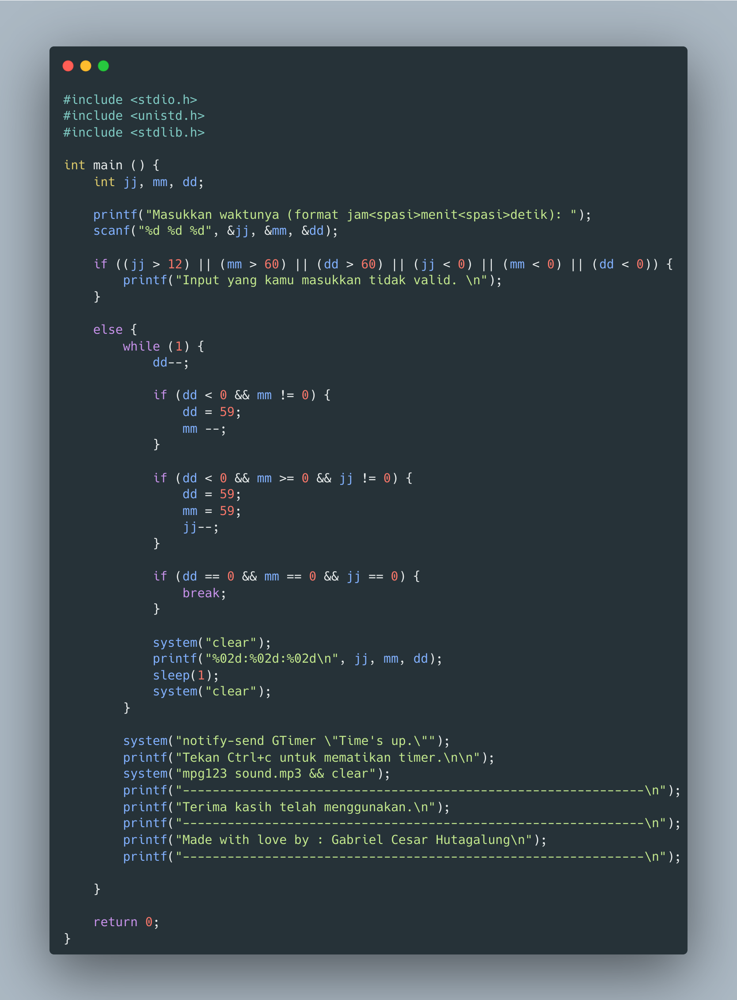

# Timer

Ini adalah program yang dibuat dengan bahasa pemrograman C yang berfungsi sebagai timer. <a href="https://youtu.be/kscIPrxSyCY">Klik disini</a> untuk melihat proses pembuatannya di youtube.

## How to use?

Berikut cara menggunakannya:
1. Clone repository ini.
2. Pasang mpg123 dari <a href="https://www.mpg123.de/download.shtml">sini</a> untuk pengguna **windows**.
3. Untuk linux, pasang mpg123 dari package manager kalian. Dalam beberapa distro, mpg123 ini sudah terpasang secara default.
4. Compile dan jalankan program tersebut.
5. Masukkan tanggal dengan format "jam<spasi>menit<spasi>detik."
   Contohnya:
   ```
    0 0 1   --> 1 detik
    1 2 0   --> 1 jam 2 menit
   ```
6. Selamat Mencoba. :smile:



## <b>About Me</b>

I'm a student at Del Institute of Technology. <br>
Bachelor of Informatics study program. <br>


<button><a href="https://www.instagram.com/gabrielhtg77/">My Instagram</a></button>
<br>
<button><a href="https://www.del.ac.id/">Institut Teknologi Del</a></button>